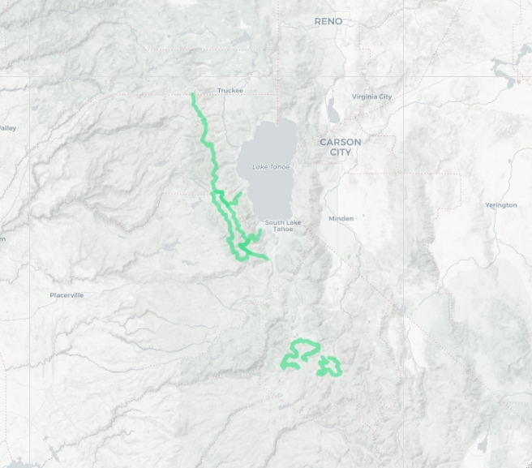

```{r include = FALSE}
knitr::opts_chunk$set(eval = FALSE)
```

*Note: this file is generated from a post on my website, [https://mitchellgritts.com/load-kml-and-kmz-files-into-r/](https://mitchellgritts.com/load-kml-and-kmz-files-into-r/). Please check there for the most up-to-date content*

I always forget it is simply `sf::read_sf` to read `.kml` files into R. That is, until it isn't. There are few instances where `sf::read_sf` behaves strangely. Mostly when attempting to read `.kmz` files.

For this post I've created a few `.kml` and `.kmz` files to use as an example, [download them here](https://github.com/kissmygritts/reprex-r-code/tree/master/2020-02-26-read-kmls/data). They are hiking trails or routes that I've been on in the past, or plan on hiking at some point. See the map below for a visual of the routes.



## Setup

It is always best to set up your R workspace before starting a project. I like to create a new RProject if I know I'll be revisiting this project in the future. The easiest way to do this is to click the little blue box in RStudio shortcut bar. Or File > New Project... from the menu bar.

Once you've done that, load the following libraries. If you don't have any installed, install them with the commented out first line of code in the snippet below.

```{r}
# install.packages(c('sf', 'fs', 'magrittr', 'leaflet'))

library(sf)
library(fs)
library(magrittr)
library(leaflet)
```

All the code is on [GitHub](https://github.com/kissmygritts/reprex-r-code/tree/master/2020-02-26-read-kmls) in an effort to make this small project more reproducible. Clone, fork, or star if you would like to. Contributions welcome!

## Read .kml

This one is easy, `sf::read_sf` and that is it. The data is all there as expected.

```{r}
library(sf)

routes_sf_1 <- read_sf('data/routes.kml')
routes_sf_1

# truncated R output
#> Simple feature collection with 4 features and 2 fields
#> geometry type:  MULTILINESTRING
#> dimension:      XYZ
#> bbox:           xmin: -120.3272 ymin: 38.49434 xmax: -119.7678 ymax: 39.31636
#> epsg (SRID):    4326
#> proj4string:    +proj=longlat +datum=WGS84 +no_defs
#> # A tibble: 4 x 3
#> ...
```

### Multilayer .kml

What happens when you try and read a `.kml` with multiple layers? `{sf::read_sf}` will warn you that the input contains multiple layers, and only the first layer is selected. In this case only 2 routes are loaded into R.

```{r}
routes_sf_2 <- read_sf('data/routes-multi.kml')
#> Warning message:
#> In evalq((function (..., call. = TRUE, immediate. = FALSE, noBreaks. = FALSE,  :
#>   automatically selected the first layer in a data source containing more than one.

# check the sf object
routes_sf_2

# truncated input
#> Simple feature collection with 2 features and 2 fields
#> geometry type:  MULTILINESTRING
#> dimension:      XYZ
#> bbox:           xmin: -120.3272 ymin: 38.83353 xmax: -120.044 ymax: 39.31636
#> epsg (SRID):    4326
#> proj4string:    +proj=longlat +datum=WGS84 +no_defs
#> # A tibble: 2 x 3
```

I didn't even know it was possible to save multi-layer `.kml` files. If you are familiar with Google Earth you can create folders to better organize your places. If you nest these folders it is possible to create a `.kml` that is has multiple layers. `routes-multi.kml` has two layers, north and south. Each layer has two features. Keep this in mind as you work through the next code block. With a little effort it is possible to load all the layers into R at once.

```{r}
input_file <- 'multi-layer.kml'

# get the layers in the kml
(kml_layers <- st_layers(input_file))

# output of kml_layers
#> Driver: KML 
#> Available layers:
#>   layer_name        geometry_type features fields
#> 1      north 3D Multi Line String        2      2
#> 2      south 3D Multi Line String        2      2

# iterate over layers, and read in idividually
# I always reach for lapply in these instances
routes_list <- lapply(kml_layers$name, function(x) {
  read_sf(input_file, layer = x)
})

# then rbind each element of the list together with Reduce
routes_sf_2 <- Reduce('rbind', routes_list)

# check for equality between routes
assertthat::are_equal(routes_sf_1, routes_sf_2)
#> [1] TRUE
```

Let's walk throught that step by step.

1. The input file will need to be used multiple times, so instead of repeating ourselves, save it to the `input_file` variable
2. `sf::st_layers` returns a list-like object of all the layers in a spatial file. In this case there are 2 layers. The name of each layer can be extracted from this object with `kml_layers$name`
3. Now iterate over each layer of the `.kml` by using the name of the layer. I almost always use `lapply` to iterate, but that isn't the only way to do it, use your favorite iteration method here. This will return a list - each element of the list is an `sf` object. 
4. Finally, consecutively `rbind` the elements of the list to each other with `Reduce` - another tool I repeatedly reach for! 

Now you should have a single `sf` object with 4 rows. I added an additional route to the `.kml` file to better illustrate how to work with multiple layers.

Remember, there are multiple ways to do this iteration. The `lapply`, `Reduce` method is one I almost always reach for. I'm very comfortable with how it works. If it seems intimidating feel free to use a `for` loop. There is nothing wrong with `for` loops. Regardless of what you may have heard about them! 

#### `lapply` in a single line?

If you're interested, the `lapply` and `Reduce` functions can be written in a single line. I opted to not do that above for readability. The choice is yours. Check the snippet below for the one-liner!

```{r}
Reduce('rbind', lapply(kml_layers$name, read_sf, dsn = input_file))
```

The gist is that `...` passes arguments to the function used within `lapply`. In this case that is the `dsn` argument in `read_sf`. Read [the `lapply` documentation](https://www.rdocumentation.org/packages/base/versions/3.6.2/topics/lapply) for more information. 

## Read .kmz

This example will depend on the version of `gdal` installed on your system. If you've only ever installed `sf` the version of `gdal` installed will not be able to read `.kmz` files. I don't know why, but [this GitHub issue](https://github.com/r-spatial/sf/issues/133) goes into much more detail. About 12 comments in [@edzer](https://github.com/edzer) provides a solution. It's a manual solutions. But we are programmers! We can code a solution!

```{r}
# try and read a .kmz with read_sf
input_file <- 'data/routes.kmz'
read_sf(input_file)

# error message output
#> Error: Cannot open "C:\Users\mgritts\Documents\routes.kmz"; 
#>    The source could be corrupt or not supported. See `st_drivers()` 
#>    for a list of supported formats.

# a workaround
input_file <- 'data/routes.kmz'
read_sf(input_file)

# workaround
target_file <- 'data/.temp.kml.zip'
fs::file_copy(input_file, target_file)
unzip(target_file, )

# read as kml now
(routes_sf_3 <- read_sf('doc.kml'))

# check for equality between routes
assertthat::are_equal(routes_sf_1, routes_sf_3)

# cleanup the temp files
fs::file_delete(target_file)
fs::file_delete('doc.kml')
```

If you don't get an error after the first line in the code above, congratulations! Your `gdal` installation is better than mine.

If you de get an error, use the workaround. Yes, I know it might be confusing to use a library called `{fs}` and a library called `{sf}`. Try and remember `sf` = simple features, and `fs` = file system.

Try this next exercise on your own. Load the multi-layer `.kmz` file into R with a similar method as a multi-layer `.kml`.

## Encapsulate it

That seems like an awful lot to think about every time a `.kml` or `.kmz` needs to be loaded into R. There is duplicate code, lots of typing, iterating, etc. This is a perfect opportunity to think about encapsulating the logic of reading `.kml`'s. Writing functions is more art than science. I'll show you how I've decided to write the function below. I encourage you to think about how you might do it before checking my solution. Remember, there isn't a single, correct answer.

KML stands for keyhole markup language. I think I'll call the function `read_keyole` since it will work for `.kml` or `.kmz`. 

```{r}
read_keyhole <- function(file) {
  # get file extension
  ext <- strsplit(basename(file), split = '\\.')[[1]][-1]
  
  # if kml
  if (ext == 'kml') {
    layers <- st_layers(file)$name
    
    if (length(layers) > 1) {
      return(Reduce('rbind', lapply(layers, sf::read_sf, dsn = file)))
    }
    
    return(read_sf(file))
  } else {
    target_file <- '.temp.kml.zip'
    
    fs::file_copy(file, target_file, overwrite = T)
    unzip(target_file, overwrite = T)
    
    sf_out <- read_sf('doc.kml')
    
    fs::file_delete(target_file)
    fs::file_delete('doc.kml')
    
    return(sf_out)
  }
}

# test function
read_keyhole('data/routes.kml')
read_keyhole('data/routes-multi.kml')
read_keyhole('data/routes.kmz')
```

Cool that works. There is a lot than can be done to improve this function. Note that I have not included a solution to load multi-layer `.kmz` files into R. I'll get to that in a future post.

## Wrap Up

Every once in a while I find problems like this that I must solve. In this instance, I was needing to import many separate `.kml` or `.kmz` files into ArcGIS Pro. Many times the imported file wouldn't display on the map properly. Not to mention I was only able to do one at a time. I figured I could speed this process up with R by iterating over all the files in a directory, loading the contents, then exporting as a geopackage. That's when I discovered the problem with multi-layer `.kml` files. 

My initial solution was very similar to the process outlined in this post. I hard coded a solution. I eventually realized that it will be useful to encapsulate all the logic into a function for better reuse. Maybe I'll only use that function a few times a year? But I won't ever have to figure out this process of loading `.kml` files again, thanks to the function (and this post)!

I was listening to an episode of [Not So Stand Deviations](http://nssdeviations.com/97-dont-do-what-you-like) shortly after beginning this post. The hosts mention that it can be difficult to find meaningful ways to increase the reproducibility when data and systems change. Which, I suppose, is true. I'm not certain why I mention it here. Just something to think about. 

### FYI

I know that there is probably a package out there that solves this problem, likely in a much more battle-tested way. I'll be honest, I didn't do much research. This was one of those times I stumbled upon a problem and decided to "scratch my own itch". That is one of the great things about learning to program. Find a problem, think of a solution, code the solution (rinse and repeat until the problem is solved). 

Even if a solution already exists I look at situations like this as opportunities to practice. Think of it as an exercise in problem solving. Or maybe just stubbornness. Regardless, I am always looking for situations to improve my skills. I happened to get lucky, yes lucky, when I stumbled upon this opportunity to practice problem solving.